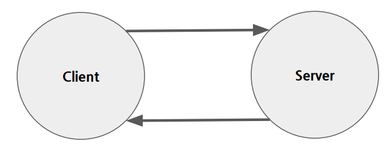
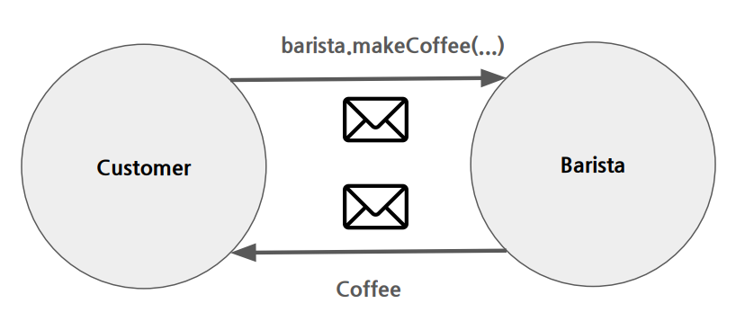

#### 변화에 적응하는 소프트웨어의 특징은 무엇일까?
- 유연성
- 확장성
- 유지 보수성

이 3가지가 충족이 된다면 변화에 적응하는 SW 제품 입니다.

## 의존?
> 어떠한 일을 자신의 힘으로 하지 못하고 다른 어떤 것의 도움을 받아 의지하는 것


### 의존은 코드에서는 어떻게 표현될까?
- 객체 참조에 의한 관계
- 메서드 리턴타입이나 파라미터로서의 의존관계
- 상속에 의한 의존 관계
- 구현에 의하 의존 관계

등 여러가지가 있을 것 입니다.   

#### "강의에서 설명은 Kotilin으로 진행하였지만, 저는 Java로 직접 해석해서 공부하였습니다"

### 1) 객체 참조에 의한 연관 관계
``` java
class ClassA {
    private ClassB b = new ClassB();

    public void someMethod() {
        b.someMethod();
    }
}

class ClassB {
    public void someMethod() {
    }
}
```
위 처럼 Class A는 ClassB의 메소드에 의존하여 사용을 합니다.

### 2) 메서드 리턴 타입이나 파라미터로서의 의존관계
```java
class ClassA {
    public ClassC methodB(ClassB b) {
        return b.someMethod();
    }
}

class ClassB {
    public ClassC someMethod() {
        return new ClassC();
    }
}

class ClassC {
}
```
위 코드는 ClassC 객체를 B가 참조하고, B객체를 A객체에서 파라미터로 참조하면서 의존하는 관계이다.

### 3) 상속에 의한 의존 관계
```java
abstract class SuperClass {
    public abstract void functionInSuper();
}

class SubClass extends SuperClass {
    @Override
    public void functionInSuper() {
        System.out.println("SuperClass의 functionInSuper() 메소드입니다.");
    }
}
```
위 코드는 추상 클래스인 SuperClass 를 SubClass에서 상속받아서 의존하는 관계를 설명하는 코드입니다. 

### 4) 구현에 의한 의존 관계
```java
public interface InterfaceA {
	void functionInterfaceA();
}

class interfaceB implements InterfaceA {
	@Override
    void functionInterface() {
		//로직
    }
}
```
위 코드는 interface 선언을 통하여, 메소드를 직접 구현을 하여 의존하는 관계를 설명하는 코드 입니다.


### 그렇다면 의존이 가지는 진짜 의미는 무엇일까?
바로 <b>변경 전파 가능성</b><br>
필요한 의존성만 유지하고, 의존성은 최소화 하는게 좋다

---

## 절차지향 과 객체지향의 차이란?
### 절차지향?
- 프로시저에 중점을 둔다
- 프로그램은 일련의 절차적 단계를 구성되고, 데이터와 프로시저가 별도로 존재한다.

### 객체지향?
- 데이터와 기능을 하나의 객체로 묶는다.

객체지향 설계를 통해서 의존을 다룰 수 있다.<br>
=> 변경이 전파되는 것을 제한하도록 돕는다.<br>

🖐 그렇다면 어떻게 제한하도록 하는 걸까?<br>
=> 객체는 자체 상태와 행동을 갖기 때문에 가능하다

🖐 그렇다면 왜 가능한걸까? <br>
=> 하나의 객체(내부)가 변경되더라도, 외부에서는 알 수 없다 -> <b>캡슐화</b> 
- 코드의 재사용성 증가
- 개발의 효율성 증가
- 보안성 향상

이런 장점들이 있습니다. 

### 그러면 객체지향 설계에서 의존을 다루는 핵심은 무엇일까요?
- Message Passing
- Encapsulation
- Dynamic Binding

#### Message Passing
클라이언트는 요청만 하면, 서버는 내부적으로 무얼 하는지 알수 없다. 하지만 응답은 온다.


클라이언트는 자신이 원하는 목적을 달성할 수 있는 서버으 API는 알고 있다.<br>
서버는 API를 통해 받은 요청을 서버가 할 수 있는 방법으로 처리한다<br>

한번 예시를 들어보겠습니다.

고객이 원하는 것 : 커피를 주문한다
고객이 커피를 주문 하는 방법 : 바리스타에게 커피 만들기 요청하기<br>
고객이 원하는 결과 : 커피


위 사진에서 고객(=클라이언트)가 Http 요청을 보내면, 서버(=바리스타)는 응답을 해줘야한다. <br>

위 과정을 실제 코드로 만들어보겠습니다.
```java
// 커피를 만드는 바리스타를 나타내는 클래스
class Customer {
	public void order(Barista barista, String coffeeType) {
		barista.makeCoffee(coffeeType);
	}

}
class Barista {
	public void makeCoffee(String coffeeType) {
		System.out.println(coffeeType + "를 만드는 중입니다.");
	}

}
public class CoffeeShop {
	public static void main(String[] args) {

		Customer customer = new Customer();
		Barista barista = new Barista();

		customer.order(barista, "아메리카노");

	}

}


```
> 결과 : 아메리카노를 만드는 중입니다.

위 코드 실행 결과는 '아메리카노를 만드는 중입니다' 라는 결과를 도출합니다.<br>
위 코드의 동작 원리 사진 입니다. 


즉 전달하는 메시지는 makeCoffee -> 메소드에 파라미터로부터 값을 도출 받아 메시지를 전달합니다.<br>

메시지를 전달하는 바리스타는 
- 어떤 API를 호출하면 되는지만 알면됩니다.

메세지를 수신하는 고객은
- 내가 주문한 것에 대한 것만return을 받으면 됩니다.

즉, 위에서 말하는 객체지향 핵심 Message Passing은,<br>
객체가 메시지를 전달 받으면, 메시지에 맞는 행동을 취하고 <br>
메시지에 맞는 응답만 도출하면 된다는 뜻 입니다.

---
#### Encapsulation
캡슐화 : 객체의 내부 상태와 동작을 외부로부터 숨기는 방법 입니다.<br>

🖐 그러면 외부로 부터 숨긴다는 것은 무엇을 의미할까요?
- 결합도를 낮추는 것을 의미합니다 -> 변경에 용이하다.

캡술화가 왜 결합도랑 변경과 관계가있는지에 대한 의문이 생길 것입니다.<br>
코드를 통해서 직접 보겠습니다

> 높은 결합도 코드
```java
class HighCouplingClass {
	private int data = 10;

	public int getData() {
		return data;
	}

	public void setData(int data) {
		this.data = data;
	}
}

class AnotherHighCouplingClass {
	private int data;

	public AnotherHighCouplingClass(HighCouplingClass highCouplingClass) {
		this.data = highCouplingClass.getData();
	}

	public int getData() {
		return data;
	}

	public void setData(int data) {
		this.data = data;
	}
}

public class Main1 {
	public static void main(String[] args) {
		HighCouplingClass highCouplingInstance = new HighCouplingClass();
		AnotherHighCouplingClass anotherHighCouplingInstance =  new AnotherHighCouplingClass(highCouplingInstance);
		System.out.println(anotherHighCouplingInstance.getData());
	}
}

```
> 결과값 : 10

위 코드는 높은 결합도를 가진 코드 입니다. 
왜 높은 결합도를 가진 코드냐면, HighCouplingClass 와 AnotherHighCouplingClass간에 <br>
강한 의존성이 있어서 입니다. <br>

AnotherHighCouplingClass 의 생성자에서 HighCouplingClass의 인스턴스를 받아와서 사용한다. <br>
이 뜻은 HighCouplingClass 에서 내부가 변경된다면 AnotherHighCouplingClass또한 수정을 해야한다는 뜻 입니다. 

> 낮은 결합도 코드
```java

```


ref : 원티드 프리온보딩_백엔드 챌린지