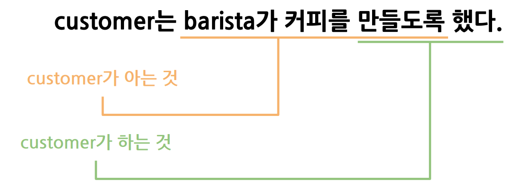
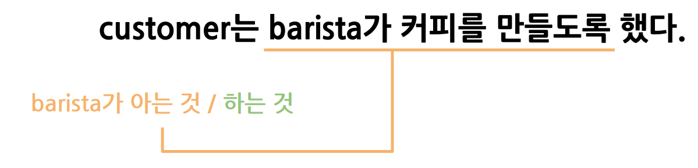

## 객체의 협력, 책임, 역할 개념 이해하기

우리가 살아가고 있는 곳에서 <b style="color:red">협력</b>은 무엇을 의미할까요?


- 우리가 무언가를 필요로 할 때 도움을 요청하는 것?
- 도움을 요청하였을 때 요청을 수락하는 것?
간단하게 이정도로 말할 수 있을 것 같습니다. 

프로그래밍에서 협력이란 단어에서 유추 할 수 있는 뜻은
- 무엇을 해야하는지
- 무엇을 누가? (잘하는지/할줄 아는지) 를 아는 것
- 무엇을 누군가에게 요청하기

그러면 객체지향 프로그래밍에서 왜 **협력**이 필요할까요❓<br>
- 객체지향 프로그래밍에서 기능을 구현하는 유일한 방법이기 때문이다.

객체가 협력을 하기 위해서는 위에서 유추한 내용이 필요합니다.
- 무엇을 해야하는지
- 무엇을 누가? (잘하는지/할줄 아는지) 를 아는 것
- 무엇을 누군가에게 요청하기

🖐 객체지향 관점에서 어떻게 협력을 할까요?<br>

1) 객체는 **Message Passing**을 통해 요청하고 협력한다. 
2) 위 사진에서 Customer 객체는 Barista 객체에게 커피 만드는 것을 요청했다
3) => Customer는 Barista가 커피를 만들도록 합니다.


- Customer 객체는 커피를 만들도록 요청하는 것에서 협력의 관점으로 본 사진 입니다.
- barista에게 커피를 -> 무엇을 요청하는지?
- 만들도록 -> 할 줄아는 바리스타에게 요청을 하는 것


- Barista는 커피를 만들줄 알기 때문에 요청을 받는다

Customer의 협력
- Barista가 무엇을 하는지 아는 것
- Barista가 할 줄 아는 것을 시키는 것

Barista의 협력
- 커피를 만드는 방법을 아는 것
- 커피를 만드는 것

이렇게 정의를 내릴 수 있습니다. 

새로운 개념이 나왔습니다.

### 책임이란?
=> 객체가 무엇을 할 수 있는지, 객체가 무엇을 하는지

얼핏보면 협력이랑 내용자체는 크게 달라진게 없어 보일 수 있습니다. 
다시 아까 사진을 보면서 **책임** 관점에서 보겠습니다.


🖐 궁금한점 1
makeCoffee라는 메시지의 책임은 어떻게 Barista에게 할당되었을까?
> Barista가 커피만드는 방법을 알기 때문에 요청이 들어왔다.

즉 책임 할당은 **할 줄 아는 사람**한테 할당이 된다
단 어떻게 얼마나 잘하는지는 모른다. 그냥 요청을 응답을 할수 만 있다면 책임이 할당된다.

그렇다면 책임이 할당 되었으면 어떤 커피일지 모르니 어떻게 만드는지를 알아야 합니다. <b>
즉, **역할**을 줘야 합니다.

그러기 위해서 makeCoffee 메시지를 담을 수있는 객체가 필요합니다.<br>

여기서 생각해낸 방법은 CoffeeMachine / HandDrip 을 생각했습니다.


##### CoffeeMachine / HandDrip -> 역할(role) 입니다.

역할을 주기 위해서는, 어떠한 역할을 요청받을지 모르니, 객체를 **추상화**하는<br>
과정이 필요합니다. 

추상화를 구현하는 방법은, **추상 클래스** or **인터페이스** 를 사용할 수 있습니다.

`역할은 구체적인 객체를 바꿔끼울 수 있는 슬롯이다`
<br>
이 말이 추상화를 말하는 것 입니다. 객체의 요청에 따라서 언제든 알맞는 것을 끼워서 요청을 주고 받음을 의미합니다.

간단하게 코드를 보여드리겠습니다
```java
interface CoffeeMaker {
	Coffee makeCoffee(String coffeeType);
}
```
위 코드처럼 인터페이스로 클래스를 구현하고<br>
간단하게 coffeeType을 makeCoffee를 하는 메소드를 하나 만들어 둡니다.
```java
class CoffeeMachine implements CoffeeMaker {
	@Override
	public Coffee makeCoffee(String coffeeType) {
		System.out.println("커피머신이 " + coffeeType + " 커피를 만드는 중입니다.");
		return new Coffee(coffeeType);
	}
}

class HandDrip implements CoffeeMaker {
	@Override
	public Coffee makeCoffee(String coffeeType) {
		System.out.println("핸드드립으로 " + coffeeType + " 커피를 만드는 중입니다.");
		return new Coffee(coffeeType);
	}
}
```
직접적인 구현은, 커피를 만드는 역할을 담당하는, **CoffeeMachine**, **HandDrip**<br>
클래스에서 담당을 합니다. CoffeeMachine역할로 요청이 오면 그에 맞는 요청을 수행해 return하고<br>
HandDrip 역할로 요청이 오면 그에 맞는 요청을 수행하여 return 합니다.


이렇게 하면 전체적인 협력,책임,역할에 대한 설명이 끝이 났습니다.

마지막으로 총정리를 한 번 해보겠습니다.
```java
public class Main{
	public static void main(String[] args) {
		LocalDateTime now = LocalDateTime.now();
		Barista barista = new Barista();
		Coffee coffee = barista.makeCoffee(now, "아메리카노");
	}
}
```
위 코드에서 coffee 객체가 makeCoffee 요청을 합니다. 
1) coffee를 시키는 사람은 고객
2) 고객은 커피를 만들줄 아는 바리스타에게 커피를 요청합니다 <br>
=> <b style="color:red">협력</b>

```java
class Barista {
	private CoffeeMaker determineCoffeeMaker(LocalDateTime now) {
		return now.getHour() < 8 || now.getHour() > 20 ? new CoffeeMachine() : new HandDrip();
	}
	public Coffee makeCoffee(LocalDateTime now, String coffeeType) {
		return determineCoffeeMaker(now).makeCoffee(coffeeType);
	}
}
```
위 코드에서 바리스타는 makeCoffee 요청을 받습니다. 
1) 바리스타는 커피를 만들 줄 알기 때문에 협력에 응답을 하고, 책임을 가집니다.<br>
   => <b style="color:red">책임</b>

이제는 책임에 따른 역할을 부여해야 합니다. <br>
위처럼 조건이 있을 때<br>
조건1 일 땐 -> 역할1<br>
조건2 일 때 -> 역할2<br>

```java
interface CoffeeMaker {
	Coffee makeCoffee(String coffeeType);
}

class CoffeeMachine implements CoffeeMaker {
	@Override
	public Coffee makeCoffee(String coffeeType) {
		System.out.println("커피머신이 " + coffeeType + " 커피를 만드는 중입니다.");
		return new Coffee(coffeeType);
	}
}

class HandDrip implements CoffeeMaker {
	@Override
	public Coffee makeCoffee(String coffeeType) {
		System.out.println("핸드드립으로 " + coffeeType + " 커피를 만드는 중입니다.");
		return new Coffee(coffeeType);
	}
}
```
역할을 추상화하여 인터페이스로 선언을 하고<br>
요청이 들어오면 요청 조건에 맞는 역할을 수행하는 메서드를 실행합니다.
=> <b style="color:red">역할</b>


객체지향 정말 어렵다고 생각합니다.<br>
잘 이해하고 응용하는 방법은, 여러 예제를 접해보고, 직접 코드를 짜보는 것이 좋다고 생각합니다. 


