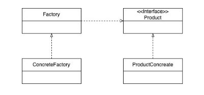

## 디자인 패턴
디자인 패턴은 왜 필요할까요?<br>

정답은 **객체지향적 설계**를 위해서 필요합니다.
- 코드 변경을 최소화 하면서 요구사항을 수용할 수 있음.
- 반복적으로 코드 설계를 하다보면 일정한 패턴이 생길꺼임
- 이러한 패턴은 특정 상황에 맞는 해결책을 빠르게 찾을 수 있도록 도와준다

그럼 디자인 패턴에 대해서 알아보자

디자인 패턴에 대표적으로 생성,행위,구조 3가지로 분류가 됩니다. 

그중에서 일단 생성 디자인 패턴에 대해서 알아보겠습니다.

## 객체의 생성을 다루는 디자인 패턴

대표적으로 3가지가 있습니다. 
1) 빌더 패턴
2) 싱글톤 패턴
3) 팩토리 패턴
   - **단순 팩토리 패턴, 팩토리 메소드 패턴**, 추상 팩토리 패턴

그중에서도 제일 많이 쓰이는 팩토리 메소드 패턴에 대해서 알아보겠습니다<br>
팩토리 패턴은 그 안에서도 3가지로 나뉩니다. 

#### 단순 팩토리 패턴
- 어떤 클래스의 인스턴스를 생성하는데 사용되는 데이터와 코드가 여러 클래스에 퍼져 있는 경우
- 생성 지식을 하나의 팩토리 클래스로 옮긴다.

한번 코드로 봐보겠습니다.
```java
//팩토리 클래스 -> 즉 메인 공장 이다.
//공장에서는 여러가지 기계를 돌린다.
//여기서 생성한 인스턴스 들이 기계들이다.
public class VehicleFactory {
    public Vehicle getVehicle(String vehicleType) {
        switch (vehicleType) {
            case "car":
                return new Car();
            case "truck" :
                return new Truck();
            default:
                throw new IllegalArgumentException("Unknowns");
        }

    }

    //클라이언트 코드
    public static void main(String[] args) {
        VehicleFactory factory = new VehicleFactory();

        Vehicle car = factory.getVehicle("car");
        car.drive();

        Vehicle truck = factory.getVehicle("truck");
        truck.drive();
    }
}

public interface Vehicle {
   void drive();
}

public class Car implements Vehicle{
   @Override
   public void drive() {
      System.out.println("Drive Car");
   }
}

public class Truck implements Vehicle{
   @Override
   public void drive() {
      System.out.println("트럭을 운전합니다.");
   }
}

```

이렇게 코드를 간단하게 짜볼 수 있습니다. <br>
같은 일을 하는 다른 기계들을 한 곳으로 모아서 실행시킨다고 볼 수 있습니다<br>

위 코드는 객체 생성을 팩토리에 위임했지만, **의존성이 크기 때문에 개방 폐쇄 원칙을 충족**시키지 못한다.

장점 
1) 생성을 위한 동작을 한곳을 모을 수 있다.
2) 생성 로직을 클라이언트로 부터 분리한다.

단점 
1) 직접 생성으로 충분한 경우 설계를 복잡하게 할 수 있다.

그러므로 적절한 상황에 맞춰서 사용을 해야할 것 입니다.


### 팩토리 메소드 패턴
- 한 상속 구조 내의 클래스들이 어떤 메소드를 각자 구현하는데 객체 생성 단계만 제외하고 나머지가 서로 유사한 경우 사용
- 해당 메소드를 슈퍼클래스로 옮기고 객체 생성은 팩토리 메소드에 맡기도록 한다.
- 팩토리와 구체 클래스의 강한 결합을 느슨하게 만든다. 
- 

위 사진을 구조를 보고서 코드를 작성해보며 이해를 해보겠습니다.

```java
public interface Vehicle {
   void drive();
}

public class Car implements Vehicle{
   @Override
   public void drive() {
      System.out.println("Drive Car");
   }
}

public class Truck implements Vehicle{
   @Override
   public void drive() {
      System.out.println("트럭을 운전합니다.");
   }
}
public abstract class VehicleFactory1 {
   public abstract Vehicle getVehicle();
}
public class TruckFactory extends VehicleFactory1 {

   @Override
   public Vehicle getVehicle() {
      return new Truck();
   }
}
public class CarFactory extends VehicleFactory1{
   @Override
   public Vehicle getVehicle() {
      return new Car();
   }
}

public class Main {
   public static void main(String[] args) {
      Vehicle car = new CarFactory().getVehicle();
      car.drive();

      Vehicle truck = new TruckFactory().getVehicle();
      truck.drive();
   }
}

```
> Drive Car
> > 트럭을 운전합니다.

위 처럼 코드를 작성할 수 있습니다

입력값(Type)을 통한 분기 처리가 아니라,
전용생성 팩토리를 둠으로 써 개방 폐쇄 원칙을 만족한다.

새로운 Vehicle이 늘어나면 공장과 Vehicle을 추가하면 변경 최소화할 수 있다

**? 팩토리 메소드 패턴 특징 ?**
- 각 concreteFactory가 개별 객체 생성에 대한 지식을 갖는다.
- 클라이언트는 개별 객체 생성에 대한 지식을 생략할 수 있다.
- 해당 객체를 얻는 인터페이스에 대한 지식만 갖는다
- 내부에서 뭘해도 클라이언트느 모른다

클라이언트는 개별 객체 생성에 대한 지식을 생략할 수 있다
- 복잡한 객체 생성은 어렵다
- 협력을 이루었다는 것은 서로에 대해서 잘 알고 있다는 것

#### 단순 팩토리 패턴 vs 팩토리 메소드 패턴

둘중 뭐가 좋을까요?
위에 코드들을 봤을 떄는 팩토리 메소드가 당연히 좋아 보입니다. <br>
실무에서 생성자가 단순한 경우에는 단순 팩토리 메소드 패턴이 좋습니다<br>
그러나 패턴이 들어가면 설계가 복잡해집니다.

=> 그러므로 본인 상황에 맞게끔 코드르 짜야 합니다. <br>
그리고 시니어 분들이 하는 말씀이 디자이패턴대로 코드를 짜려고 하면 코드를 짜기 어려우니<br>
주니어 일떄는 너무 디자인패턴을 고려하고 코드를 짜지 않아도 된다고 합니다<br>
자연스럽게 코드를 짜고 나중에 보면, 다양한 디자인 패턴이 쓰여져 있다고 하네요

#### 생성을 다루는 디자인 패턴이 중요한이유?
- 생성자는 생성하려는 행위를 추상화 할 수 없다.
- 생성을 다루는 디자인 패턴은 생성하려는 행위를 추상화 할 수 없다
- 클라이언트 코드는 구체적인 클래스를 몰라도 되기 때문에 유연하게 객체를 생성할 수 있다
  - 즉 캡슐화의 이점을 누린다

  
   
## 객체의 구조를 다루는 디자인 패턴
구조를 다룬다?
- 객체가 여러 의존성을 가지고 있을 때에 의존성을 어떻게 분리할 것인가?

여기서는 
1) 퍼사드(Facade) 패턴
2) 컴포지트 패턴

이 두가지를 알아볼 것 입니다. 

### 퍼사드 패턴
1) 개방 폐쇄 원칙
- 추상 인터페이스만 알게하고, 구상 객체를 외부에서 가져오게끔 책임을 미룬다
- 어딘가에는 구상 객체를 다 알고 있는 녀석이 존재한다. => 메인 클래스는 다 알고있음

책임을 미루면 계속 미룰 수 있지만, 레이어의 경계에서 의존성 전파를 절단하는 용도가 퍼사드 이다.

즉 의존성 전파를 퍼사드 패턴을 통해 멈추는 것 이다.

이제 코드를 통해 봐보겠습니다.
```java
public interface MessageSender {
    void send(String message);
}
public class EmailSender implements MessageSender{
    @Override
    public void send(String message) {
        System.out.println("Email-message = " + message);
        //이메일 보내는 로직
    }
}
public class SMSSender implements MessageSender{
    @Override
    public void send(String message) {
        System.out.println("SMS-message = " + message);
        //SMS보내는 로직
    }
}
public class MessageService {
    private final MessageSender sender;

    public MessageService(MessageSender sender) {
        this.sender = sender;
    }

    public void send(String message) {
        sender.send(message);
    }
}
public class MainFacade {
    public static void main(String[] args) {
        MessageService emailService = new MessageService(new EmailSender());
        emailService.send("hello-email");

        MessageService  mmsService = new MessageService(new SMSSender());
        emailService.send("hello-mms");
    }
}

```
즉 퍼사드 패턴은 의존성의 집합체이면서 인터페이스의 집합체이다. 

그럼 위에서말한 서비스 레이어는 뭘까요?
서비스 레이어를 이해하기 위해서는 **레이어드 아키텍쳐**에 대한 개념을 알야야 합니다.
https://hyeonq.tistory.com/131 <br>
간단하게 설명을 하면은

웹 레이어 -> 서비스 레이어 -> 레포지토리 레이어 이렇게 3Layer 구조로 되어있다고 가정했을 때<br>

웹 레이어에서 레포지토리로 바로 접근하면 웹 레이어가 복잡해진다<br>
그러므로 서비스를 만들어 서비스에 복잡한 로직을 다 넣는다. <br>
그렇다면 웹 레이어 입장에서 서비스의 로직은 알고, 레포지토리는 모를 것이다<br>
즉 의존성이 있는지 없는지를 모른다<br>

간단하게 말하면 서비스는 간이 퍼사드 패턴을 적용한 것입니다 

위 내용은 직접 3Layers 아키텍쳐를 설계해보면서 이해를 하는게 빠를 거라고 생각합니다.


### 컴포지트 패턴(Composite Pattern)


바로 코드를 보겠습니다
```java
public interface Animal {
    void speak();
}

public class Cat implements Animal{
    @Override
    public void speak() {
        System.out.println("고양이가 냥냥된다");
    }
}

public class Dog implements Animal{
    @Override
    public void speak() {
        System.out.println("강아지가 왈왈 된다");
    }
}

public class Zoo implements Animal{
    @Override
    public void speak() {
        System.out.println("동물원 동물들이 말을하네??");
    }
}

public class AnimalGroup implements  Animal{

    private List<Animal> animals = new ArrayList<>();

    public void add(Animal animal) {
        animals.add(animal);
    }
    @Override
    public void speak() {
        for(Animal animal : animals) {
            animal.speak();
        }
    }
}

public class CompositeMain {
    public static void main(String[] args) {
        AnimalGroup catGroup = new AnimalGroup();
        catGroup.add(new Cat());
        catGroup.add(new Cat());
        catGroup.add(new Cat());

        AnimalGroup dogGroup = new AnimalGroup();
        dogGroup.add(new Dog());
        dogGroup.add(new Dog());
        dogGroup.add(new Dog());

        AnimalGroup zooGroup = new AnimalGroup();
        zooGroup.add(new Zoo());
        zooGroup.add(dogGroup);
        zooGroup.add(catGroup);

        zooGroup.speak();

    }
}

```
> 동물원 동물들이 말을하네??
강아지가 왈왈 된다
강아지가 왈왈 된다
강아지가 왈왈 된다
고양이가 냥냥된다
고양이가 냥냥된다


이 패턴을 핵심은 
- 그룹과 오브젝트가 같은 인터페이스를 제공함으로써 루트에서 시작된 함수가 모든 오브젝트로 퍼지는 구조
- 그룹을 오브젝트를 같은 타입으로 바라보는 것이 핵심

이 내용은 저도 너무 어려웠고, 이해가 잘 되지않아서 조금 더 공부를 해봐야겠습니다


## 객체의 행동을 다루는 디자인 패턴
- 복잡한 메소드를 어떻게 분산 시킬까?

다양한 행동패턴 중에서 **템플릿 메소드** 패턴에 대해서만 알아보겠습니다.

#### 템플릿 메소드 패턴
- 실행과정은 동일한데 일부 구현이 다른 경우에 사용할 수 있는 패턴
- 상위 클래스에서 실행 과정을 구현한 메소드 제공
- 일부 단계는 추상 메소드를 호출하는 방식

바로 코드로 보겠습니다
```java
 public abstract class Game {

    public void play() {
        initialize();
        startPlay();
        endPlay();
    }

    protected abstract void initialize();
    protected abstract void startPlay();
    protected abstract void endPlay();
}

public class Chess extends Game {

    @Override
    protected void initalize() {
        System.out.println("체스 게임 초기화");
    }

    @Override
    protected void startPlay() {
        System.out.println("체스 게임 시작");
    }

    @Override
    protected void endPlay() {
        System.out.println("체스 게임 종료");
    }
}

public class Football extends Game{
    @Override
    protected void initialize() {
        System.out.println("풋볼게임 초기화");
    }

    @Override
    protected void startPlay() {
        System.out.println("풋볼게임 시작");
    }

    @Override
    protected void endPlay() {
        System.out.println("풋볼게임 종료");
    }
}
```

템플릿 메소드는 public, final 사용<br>
하위 클래스에서 제공하는 훅은 protected 사용


여기까지가 자주 사용하는 디자인 패턴에 대해서 알아보았습니다.<br>
디자인 패턴은 너무너무 많고, 다 알 수 없다고 생각합니다. <br>
그러므로 자주 사용하는 것 위주로 학습을 하고, 따로 공부를해보며 실무에 적용해가보는 것이 좋다고 생각합니다<br>

결국 객체지향을 잘 활용하려면 디자인패턴은 꼭 알아야하는 내용이라고 생각하기 때문에<br>
꾸준히 연습을 해야할 것 같습니다. 

결국 아는 것과 사용할 줄 아는 것은 큰 차이이기 때문에, 사용할 줄 아는 단계가 되기위해 노력을 하고 있습니다.


ref : 원티드 프리온보딩 백엔드 챌린지 2024.01월
ref : https://refactoring.guru/ko/design-patterns